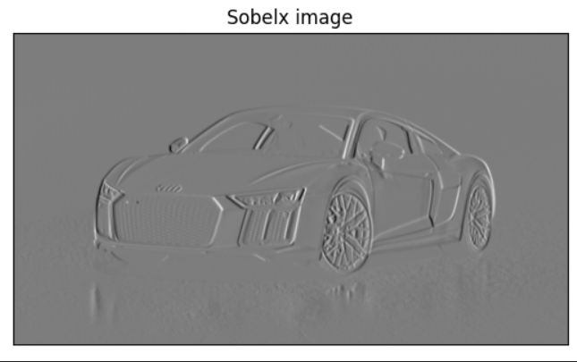
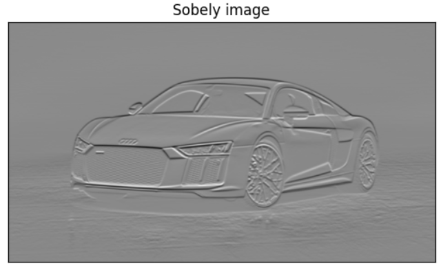
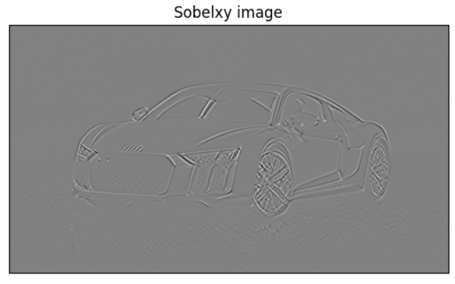
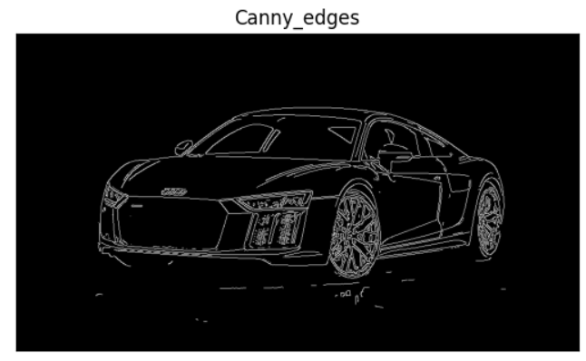

# Edge-Detection
## Aim:
To perform edge detection using Sobel, Laplacian, and Canny edge detectors.

## Software Required:
Anaconda - Python 3.7

## Algorithm:
### Step1:
Import all the necessary modules for the program.
### Step2:
Load a image using imread() from cv2 module.

### Step3:
Convert the image to grayscale.
### Step4:
Using Sobel operator from cv2,detect the edges of the image.
### Step5:
Using Laplacian operator from cv2,detect the edges of the image.
### Step6:
Using Canny operator from cv2,detect the edges of the image.
## Program:
# Import the packages
```python
Developed by : YUVARAJ.S
Register Number: 22008589
import cv2
import matplotlib.pyplot as plt

```


# Load the image, Convert to grayscale and remove noise
```python
Developed by : YUVARAJ.S
Register Number: 22008589
import cv2
import matplotlib.pyplot as plt
image = cv2.imread('car.jpg')
gray_image = cv2.cvtColor(image,cv2.COLOR_RGB2GRAY)
cv2.imshow('Gray image',gray_image)
cv2.waitKey(0)
cv2.destroyAllWindows()
img = cv2.GaussianBlur(gray_image,(3,3),0)

```


# SOBEL EDGE DETECTOR
```python
Developed by : YUVARAJ.S
Register Number: 22008589
sobelx = cv2.Sobel(img,cv2.CV_64F,1,0,ksize=5)
plt.figure(1)
plt.imshow(sobelx,cmap ='gray')
plt.title('Sobelx image')
plt.xticks([])
plt.yticks([])
plt.show()
sobely = cv2.Sobel(img,cv2.CV_64F,0,1,ksize=5)
plt.figure(1)
plt.imshow(sobely,cmap ='gray')
plt.title('Sobely image')
plt.xticks([])
plt.yticks([])
plt.show()
sobelxy = cv2.Sobel(img,cv2.CV_64F,1,1,ksize=5)
plt.figure(1)
plt.imshow(sobelxy,cmap ='gray')
plt.title('Sobelxy image')
plt.xticks([])
plt.yticks([])
plt.show()
```


# LAPLACIAN EDGE DETECTOR
```python
Developed by : YUVARAJ.S
Register Number: 22008589
laplacian = cv2.Laplacian(img,cv2.CV_64F)
plt.figure(1)
plt.imshow(laplacian,cmap ='gray')
plt.title('Laplacian image')
plt.xticks([])
plt.yticks([])
plt.show()
```


# CANNY EDGE DETECTOR
```python
Developed by : YUVARAJ.S
Register Number: 22008589
canny_edges = cv2.Canny(img,120,150)
plt.figure(1)
plt.imshow(canny_edges,cmap ='gray')
plt.title('Canny_edges')
plt.xticks([])
plt.yticks([])
plt.show()


```
## Output:
### ORIGINAL IMAGE

###  Convert to grayscale and remove noise

### SOBEL EDGE DETECTOR



### LAPLACIAN EDGE DETECTOR


### CANNY EDGE DETECTOR

## Result:
Thus the edges are detected using Sobel, Laplacian, and Canny edge detectors.
